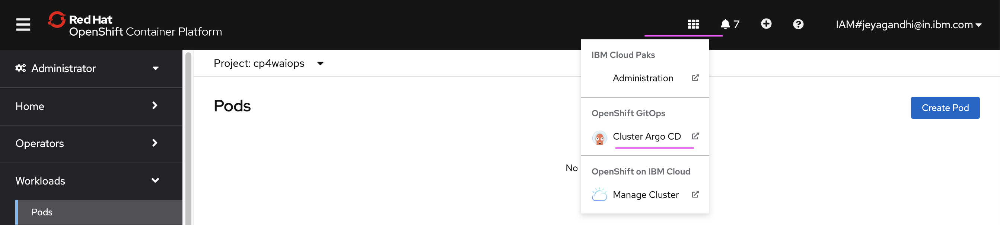

# SWE execution in local environment

This documentation demonstrates the steps to test the developed IBM SWE gitops module locally by pointing to desired OpenShift cluster and GitHub repository.

## 1. Update terraform.tfvars

Update the below properties in `/test/stages/terraform.tfvars` file .

### 1.1 ibmcloud_api_key

Generate the key from  https://cloud.ibm.com/iam/apikeys

### 1.2 cp_entitlement_key

Get the entitlement key from  https://myibm.ibm.com/products-services/containerlibrary

### 1.3 server_url

The server where you are going to apply the terraform module.

The `oc login` command of the OCP cluster would be like this.

```
oc login --token=sha256~62DwshrR-4tR2w_..............i8dx8 --server=https://c117-e.us-south.containers.cloud.ibm.com:11111
```
Here the `server_url` is `https://c117-e.us-south.containers.cloud.ibm.com:11111`

### 1.4 login_token

From the above exmaple, the `login_token` is `sha256~62DwshrR-4tR2w_..............i8dx8`

### 1.5 namespace

The namespace could be `cp4waiops` where this module is going to run.

### 1.6 git_org

Create new org in github and give the value. 

Click the `New Organization` button in https://github.com/settings/organizations  to create new Org.

### 1.7 git_username

You github user name

### 1.8 git_token

You github Personal access token.

Click the `Generate New Token` button in https://github.com/settings/tokens to create token

### 1.9 git_repo

Give any non existing github repo name. This will be created while running this module.

## 2. Create Symbolic link

Create a symbolic link to current module code execution `stage2-xxxxxxxx.tf) `  by running following command in command prompt in `test/stages` directory:

```
ln -s ../.. module
```

## 3. Install yq4

yq is needed to run locally.

1. Make sure that you are the root folder of this repo `terraform-gitops-cp-waiops-draft`. 

2. Install yq by running the below command

```
brew install yq 
```

3. Run the below command to copy the `yq` executable inside `test/stages/bin2`

```
cp /usr/local/bin/yq ./test/stages/bin2/
cp /usr/local/bin/yq ./test/stages/bin2/yq4
```

4. Run the below command to create yq4 from yq

```
cp /usr/local/bin/yq ./test/stages/bin2/yq4
```

5. Run yq4

Run the yq4 to test whether is there. Make sure it has execute permission.

```
/test/stages/bin2/yq4
```

## 3. Install kubeseal

Make sure that you are the root folder of this repo `terraform-gitops-cp-waiops-draft`. 

Run the below command one by one.

```
brew install kubeseal
cp /usr/local/bin/kubeseal ./test/stages/bin/
```

## 4. Run Terraform Module

1. Goto the `test/stages` directory

2. Run the below command

```
terraform init
```
This will download all required modules in .terraform directory inside test/stages.

3. Run the below command

```
terraform plan
```
This will make a dry-run and provides a list of resources to be added/destroyed and also any syntax/reference errors.

4. Run the below command

```
terraform apply --auto-approve
```
This command will provision resources in mentioned cluster.


## 5. Open ArgoCD

1. Open the ArgoCD



2. ArgoCD Credentials

- UserName : admin
- Passowrd : Is available in  `.test/stages/.tmp/argocd-password.val`

3. View the Sync details of all the application created.

